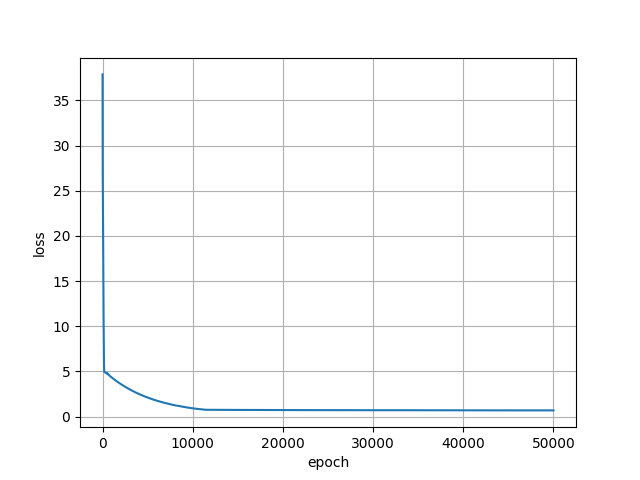
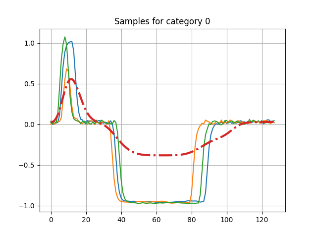
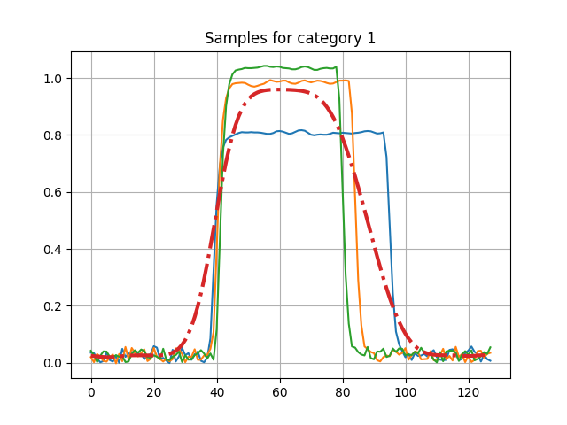
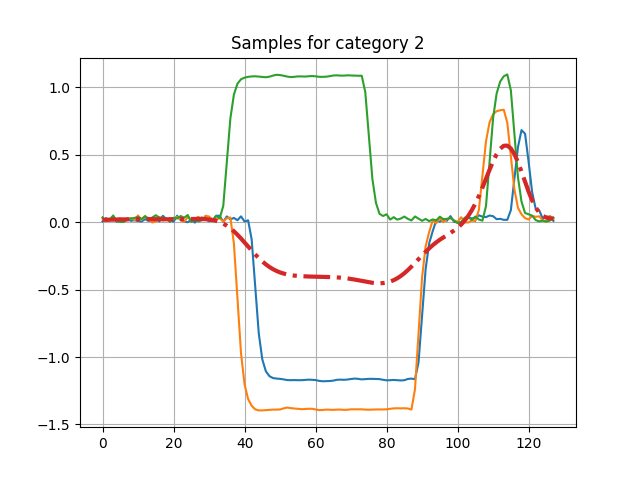
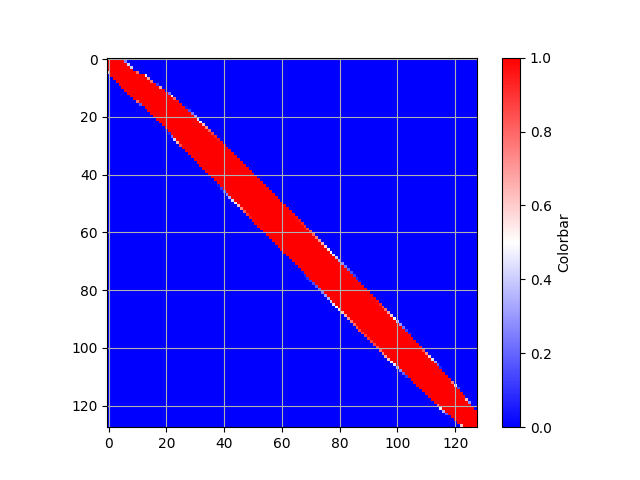
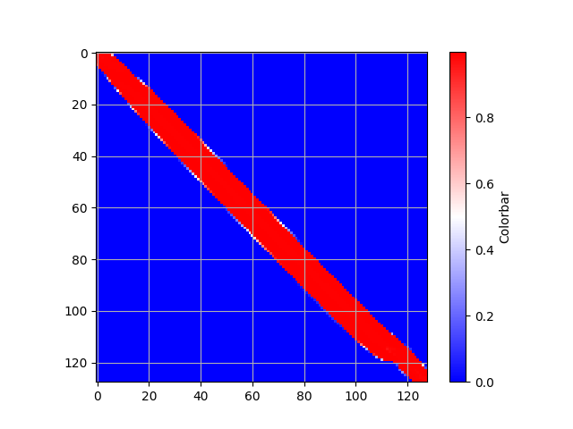
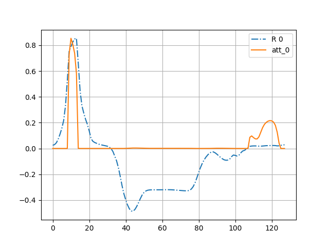
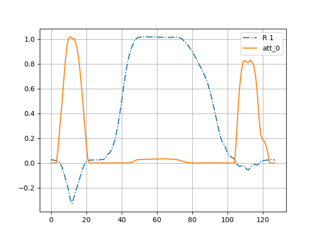
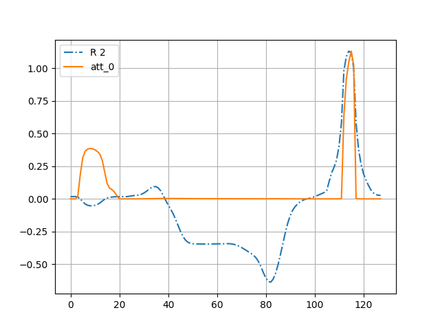

# teNN, Time Elastic Neural Networks
### Implementation of teNN (Time Elastic Neural Networks) defined and experimented in [[1](#1)]. The teNN code itself is written in C and its Python wrapper uses the foreign ctype library.

## Requirements 
- gcc compiler
- python3.*
- matplotlib
- ScikitLearn

## To compile the c code
$ cd \<teNN install directory\>\
$ sh compile.sh

## Testing teNN on BME UCR dataset
$ python3  teNN_Benchmark.py --dataset BME --no_display --nu0 1e-6 --batch_size 0 --eta 1e-2 --nclusters 1 --lambda_At 1e-4 --lambda_Ac 1e-4 --corridor_radius 500

## BME dataset
### Training loss

### Few samples for each category. The initial reference time series are presented in dotted red lines.

### The activation matrices for each category

### The attention matrices (vectors) for each category. The final class reference time series is given in blue dotted lines.

Please cite this article if you wish to reference teNN:

<a name="#1">
   [1] </a> 
Marteau, P.F., Times Elastic Neural Networks, preprint, [ArXiv May 2024](https://arxiv.org/abs/2405.17516), 
[bibtex](./bibtex/marteau2024.bib)

