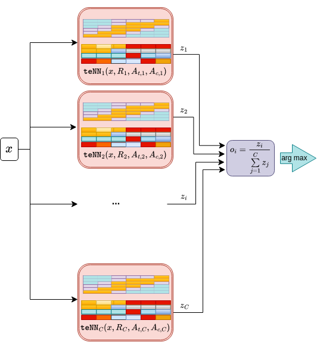
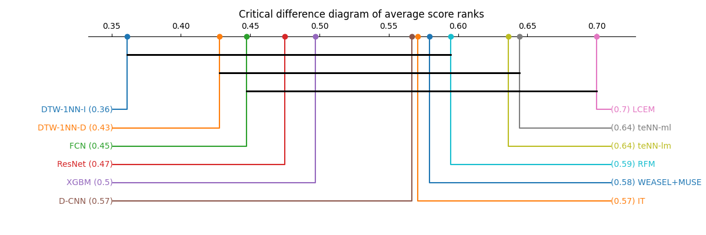

# teNN, Time Elastic Neural Networks
### Implementation of teNN (Time Elastic Neural Networks) defined and experimented in \[[1](#1)\]. The teNN code itself is written in C and its Python wrapper uses the foreign ctype library.

The teNN architecture is based on the theory of time-elastic kernels and is mainly dedicated to the classification of univariate or multivariate time series. This atypical type of neural network architecture integrates a specific attention mechanism capable of handling temporal elasticity. In addition, teNN integrates a neuron pruning strategy (based on their inactivation) that, while dynamically reshaping the neural architecture itself, allows to drastically reduce the number of model parameters. teNN is efficiently trained using stochastic gradient descent using direct evaluation of categorical cross-entropy loss derivatives, thus avoiding the traditional backpropagation mechanism. Finally, it provides interpretable results and contributes to the explainable AI initiative.

## Requirements 
- gcc compiler
- python3.*
- matplotlib
- ScikitLearn

## To compile the c code
$ cd \<teNN install directory\>\
$ sh compile.sh

## Testing teNN on BME UCR dataset
$ python3  teNN_Benchmark.py --dataset BME --no_display --nu0 1e-6 --batch_size 64 --eta 1e-2 --nclusters 1 --lambda_At 1e-4 --lambda_Ac 1e-4 --corridor_radius 500

$$\color{red}{\text{To stop the training process, type ctrl-c.}}$$

## [BME](https://www.timeseriesclassification.com/description.php?Dataset=BME) dataset
### Training loss

### Few samples for each category. The initial reference time series are presented in dotted red lines.

### The activation matrices for each category

### The attention matrices (vectors) for each category. The final class reference time series is given in blue dotted lines.

## Classification accurracies obtained by state of the art classifiers on 30 multivariate datasets
**IT** (Inception time NN), **D-CNN** (Dilated Convolutional Neural Network), **FCN** (fully connected convolutional network), **ResNet**, **LCEM** (Local Cascade Ensemble for Multivariate data), **XGBM** (Extreme Gradient Boosting for Multivariate data), **RFM** (Random Forest for Multivariate data), **WEASEL + MUSE** (Word ExtrAction for time SEries cLassification plus Multivariate Unsupervised Symbols and dErivative), **DTW-I** (1-Nearest Neighbor classifier based on the sum of DTW distance for each dimension), **DTW-D** (1-Nearest Neighbor classifier based on multi-dimensional points), **teNN-lm** (teNN at last minimum train error), **teNN-ml** (teNN at minimum training loss)

|Datasets|teNN-lm|teNN-ml|IT|D-CNN|FCN|ResNet|LCEM|XGBM|RFM|WEASEL+MUSE|DTW-1NN-I|DTW-1NN-D|
|--- |--- |--- |--- |--- |--- |--- |--- |--- |--- |--- |--- |--- |
|Datasets|teNN-lm|teNN-ml|IT|D-CNN|FCN|ResNet|LCEM|XGBM|RFM|WEASEL+MUSE|DTW-1NN-I|DTW-1NN-D|
|ArticularyWordRecognition|98.3|98.3|98.7|98.7|98.0|98.0|99.3|99.0|99.0|99.3|98.0|98.7|
|AtrialFibrillation|33.3|33.3|20.0|40.0|33.3|33.3|46.7|40|33.3|26.7|26.7|20.0|
|BasicMotions|100.0|100.0|100.0|100.0|100.0|100.0|100.0|100.0|100.0|100.0|100.0|97.5|
|CharacterTrajectories|99.4|99.4|98.8|99.4|98.7|99.4|97.9|98.3|98.5|99.0|96.9|99.0|
|Cricket|98.6|98.6|98.6|97.7|93.1|97.2|98.6|97.2|98.6|98.6|98.6|100|
|DuckDuckGeese|46.0|46.0|36.0|50.0|36.0|24.0|37.5|40.0|40.0|57.5|55|60.0|
|EigenWorms|0.0|0.0|52.7|59.3|42.0|42.0|52.7|55|100|89.0|60.3|61.8|
|Epilepsy|90.6|90.6|99.3|89.0|99.3|99.3|98.6|97.8|98.6|99.3|97.8|96.4|
|Ering|97.4|97.4|93.0|91.11|90.4|93.0|20|13.3|13.3|13.3|13.3|13.3|
|EthanolConcentration|36.5|36.5|34.9|27.8|32.3|31.6|37.2|42.2|43.3|31.6|30.4|32.3|
|FaceDetection|63.7|63.7|58.9|56.7|50.4|59.5|61.4|62.9|61.4|54.5|51.3|52.9|
|FingerMovements|57.0|57.0|56.0|54.0|53.0|54.0|59.0|53.0|56.0|54.0|52.0|53.0|
|HandMovementDirection|55.4|55.4|37.8|54.1|29.7|28.4|64.9|54.1|50.0|37.8|30.6|23.1|
|Handwriting|41.8|41.8|30.1|23.7|37.6|18.0|28.7|26.7|26.7|53.1|50.9|60.7|
|Heartbeat|74.2|75.1|62.5|71.7|67.8|72.7|76.1|69.3|80.0|72.7|65.9|71.7|
|InsectWingbeat|52.9|52.9|69.6|63.1|60.0|65.0|22.8|23.7|22.4|12.8|12.8|0.|
|JapaneseVowels|97.3|97.3|97.0|97.6|97.3|91.4|97.8|96.8|97.0|97.8|95.9|94.9|
|Libras|81.1|81.1|87.2|85.8|85.0|83.9|77.2|76.7|78.3|89.4|89.4|87.2|
|LSST|49.6|49.6|44.6|55.6|56.2|57.3|65.2|63.3|61.2|62.8|57.5|55.1|
|MotorImagery|61.0|59.0|53.0|49.0|55.0|52.0|60.0|46.0|55.0|50.0|39.0|50.0|
|NATOPS|93.3|93.3|91.7|92.8|87.8|89.4|91.6|90.0|91.1|88.3|85.0|88.3|
|PEMS-SF|28.9|28.9|89.0|89.0|83.2|74.0|94.2|98.3|98.3|70.5|71.1|70.5|
|PenDigits|97.2|97.2|98.0|97.1|98.6|97.7|97.7|95.1|95.1|96.9|93.9|97.7|
|PhonemeSpectra|8.6|8.6|15.9|28.2|16.0|16.0|28.8|18.7|22.2|19.0|15.1|15.1|
|RacketSports|88.8|88.8|82.2|83.6|82.2|82.2|94.1|92.8|92.1|91.4|84.2|80.3|
|SelfRegulationSCP1|88.1|89.4|86.3|88.4|78.2|83.6|83.9|82.9|82.6|74.4|76.5|77.5|
|SelfRegulationSCP2|54.4|57.8|47.2|51.7|46.7|50.0|55.0|48.3|47.8|52.2|53.3|53.9|
|SpokenArabicDigits|97.7|97.7|98.7|98.6|98.4|98.3|97.3|97.0|96.8|98.2|96.0|96.3|
|StandWalkJump|53.3|53.3|40.0|33.3|40.0|40.0|40.0|33.3|46.7|33.3|33.3|20.0|
|UWaveGestureLibrary|90.3|90.3|90.9|89.1|85.0|85.0|89.7|89.4|90.0|90.3|86.9|90.3|

(*) The current implementation of teNN  does not allow to handle this dataset.

### Critical Difference Diagramm of average ranks (the higher the better)

### If you wish to reference teNN, please cite this draft paper:

[1] Marteau, P.F., Times Elastic Neural Networks, preprint, May 2024, arXiv:2405.17516, 
[ArXiv](https://arxiv.org/abs/2405.17516), 
[bibtex](https://github.com/pfmarteau/teNN/blob/main/bibtex/marteau2024.bib)
